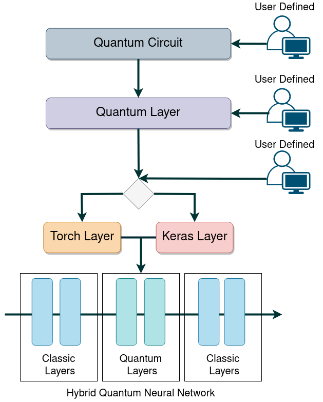

# Hybrid Quantum Models

This library comprises a collection of functions and classes tailored to manage quantum algorithms or circuits that have the capability to interface with two of the most prevalent deep learning libraries, tensorflow and torch. Furthermore, the library incorporates a set of predefined hybrid models for tasks such as classification and regression.

To delve deeper into the significance of this library, let's break down its key components and functionalities. Firstly, it offers a diverse set of tools for the manipulation and execution of quantum algorithms. These algorithms harness the principles of quantum mechanics to perform operations that transcend the capacities of classical computers. The library provides an intuitive interface for fully leveraging their potential, ensuring seamless interaction with tensorflow and torch, two widely adopted Deep Learning frameworks.

Additionally, the library goes the extra mile by including a set of predefined hybrid models. These models are ready-made solutions for common machine learning tasks such as classification and regression. They seamlessly blend the power of quantum circuits with the traditional deep learning approach, offering developers an efficient way to address various real-world problems.

In summary, this library serves as a versatile bridge between the realms of quantum computing and Deep Learning. It equips developers with the tools to harness the capabilities of quantum algorithms while integrating them effortlessly with tensorflow and Torch. Furthermore, the inclusion of prebuilt hybrid models simplifies the development process for tasks like classification and regression, ultimately enabling the creation of advanced AI solutions that transcend classical computing limitations.

<a class="btn btn-success" href="https://alessandrosebastianelli.github.io/hybrid_quantum_models/hqm.html" target="_blank">Click here to access the documentation</a>

**!!!This library has been developed and tested mostly for QAI4EO (Quantum Artificial Intelligence for Earth Observation) tasks!!!**

## Installation

This package is stored on [PyPi](https://pypi.org/project/hqm/), you can easily install it using pip

```bash
pip install --upgrade hqm
```

Although certain elements of this library draw from PyTorch or TensorFlow, these two packages are not included in the library's prerequisites, and therefore, they will not be automatically installed. It is advisable to use the following recommended versions for PyTorch and TensorFlow:

```bash
pip install tensorflow==2.13.0
```

```bash
pip install torch==2.0.1
```

## Usage

The central concept of this package is illustrated in the figure below. In essence, the package generates an embedding of a user-defined quantum circuit (chosen from the available options) into a quantum layer, which is also customizable by the user. This quantum layer can subsequently be converted into a Keras layer or a Torch layer, allowing it to be seamlessly combined with other classical or quantum layers.




A full description of each module can be found in the documentation.